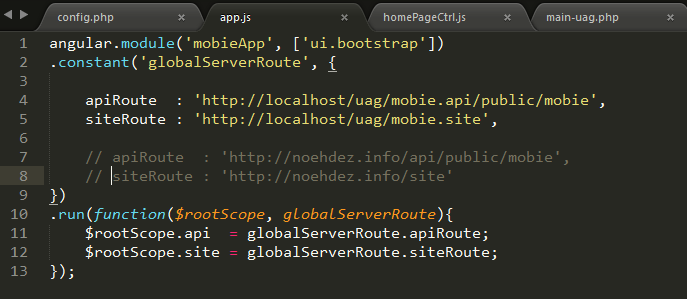
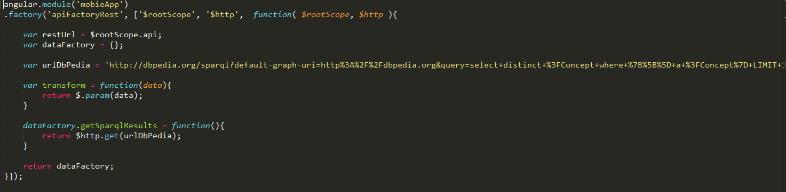
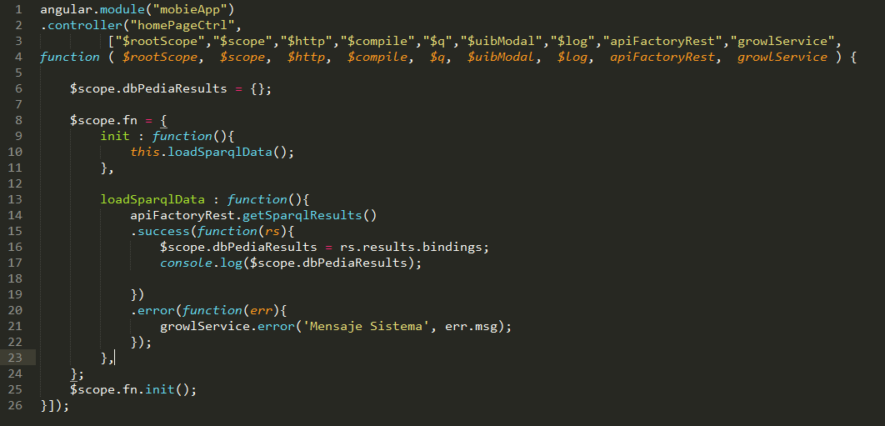
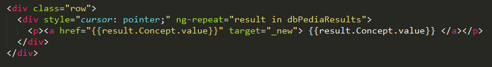

* Materia: Recuperación de Información de la Web
* Alumno: JOSÉ NOÉ HERNÁNDEZ VIVANCO
* Número: 3024021

- Proyecto final de SPARQL con el uso de la API de Dbpedia utilizando Angular JS
- Este proyecto fue desarrollado en Angular JS y a continua se describe de manera genera su implementación:

## Configuración de Angular ##
Todo proyecto de angular deber tener un controlador y un punto de partida de la aplicación, aquí su implementación:

## Configuración del Servicio de Sparql mediante un Angular Factory ##
Aquí utilizamos una técnica llama "Factory", fabrica de objectos. En esta implementación hacemos el llamado del REST a dbpedia y la retornamos como un objecto "Factory"

## Configuración del Controllador ##
Aquí es donde mandamos a llamar el Factory de la función "getSparqlResults" que nos devuelve los datos del REST de dbpedia

## Llamado de los resultados ##
Aquí iteramos los datos que nos devolvio el objecto "dbPediaResults"

Si deseas verlo en acción puede dirigirte a la pagina:  http://noehdez.info/site

--------
Soporte y dudas
--------

email: donoe1985@gmail.com

